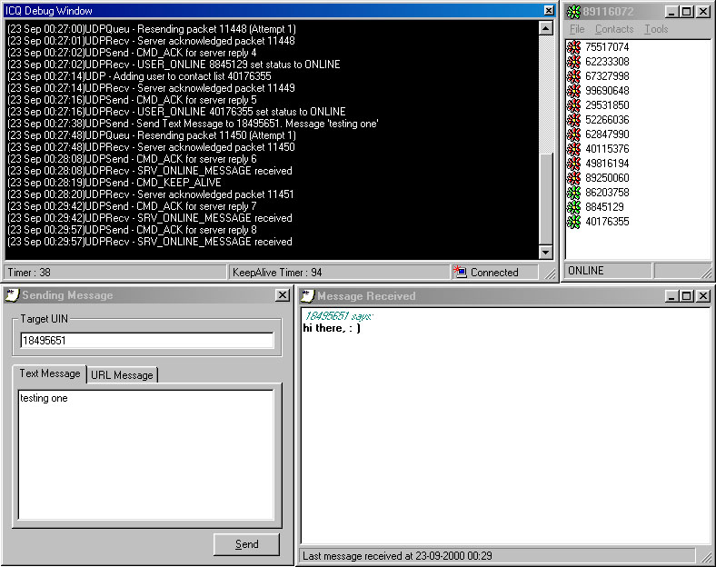



## Simple ICQ Client

### Description

The first ICQ client made in VB, at the moment, it can send receive message/url. Check user's online/offline status, change status to Invisible, Away, N/A, etc.
 
### More Info
 
This is only a preview of the current ICQ client that is still under construction. This is very basic and some of the function might still have some error, as I have not implement much error trapping in it.

             |
---                |---
**Submitted On**   |2000-09-23 00:39:42
**By**             |[James Salim](https://github.com/Planet-Source-Code/PSCIndex/blob/master/ByAuthor/james-salim.md)
**Level**          |Intermediate
**User Rating**    |5.0 (80 globes from 16 users)
**Compatibility**  |VB 6\.0
**Category**       |[Internet/ HTML](https://github.com/Planet-Source-Code/PSCIndex/blob/master/ByCategory/internet-html__1-34.md)
**World**          |[Visual Basic](https://github.com/Planet-Source-Code/PSCIndex/blob/master/ByWorld/visual-basic.md)
**Archive File**   |[CODE\_UPLOAD100839222000\.zip](https://github.com/Planet-Source-Code/james-salim-simple-icq-client__1-11626/archive/master.zip)

